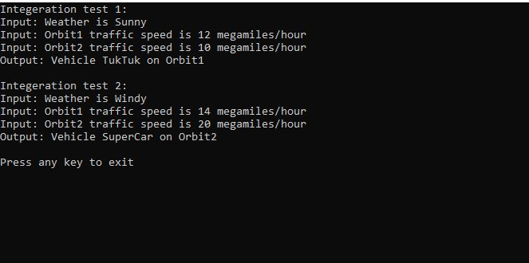

# Lengaburu Traffic Problem

## Solution

This project is the solution for the Lengaburu Traffic problem written in C#

### Code Style
- Solution follows object oriented programming principles
- Solution is developed in Test Driven Development approach

### To view the output
#### PreRequisite
  - Visual studio 2015 or above is needed.

The cases given in the problem statements is covered as integeration test. Run the solution file to check the outputs quickly.
 

### Test
Unit tests are written with [MSTest.TestFramework](https://www.nuget.org/packages/MSTest.TestFramework/) and [Moq](https://github.com/Moq/moq4/wiki/Quickstart) used as mocking framework
